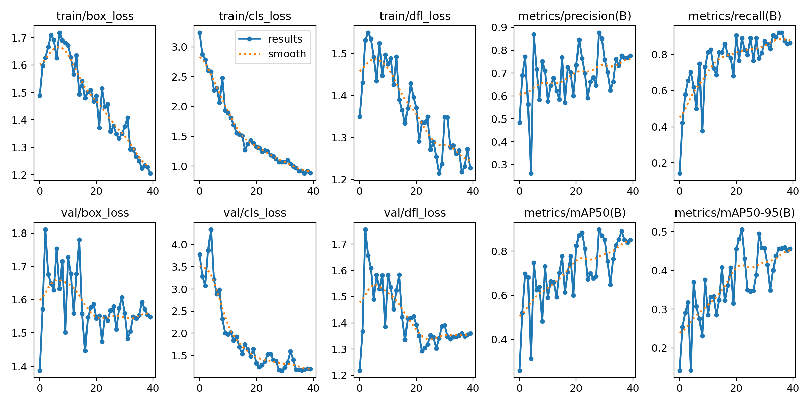
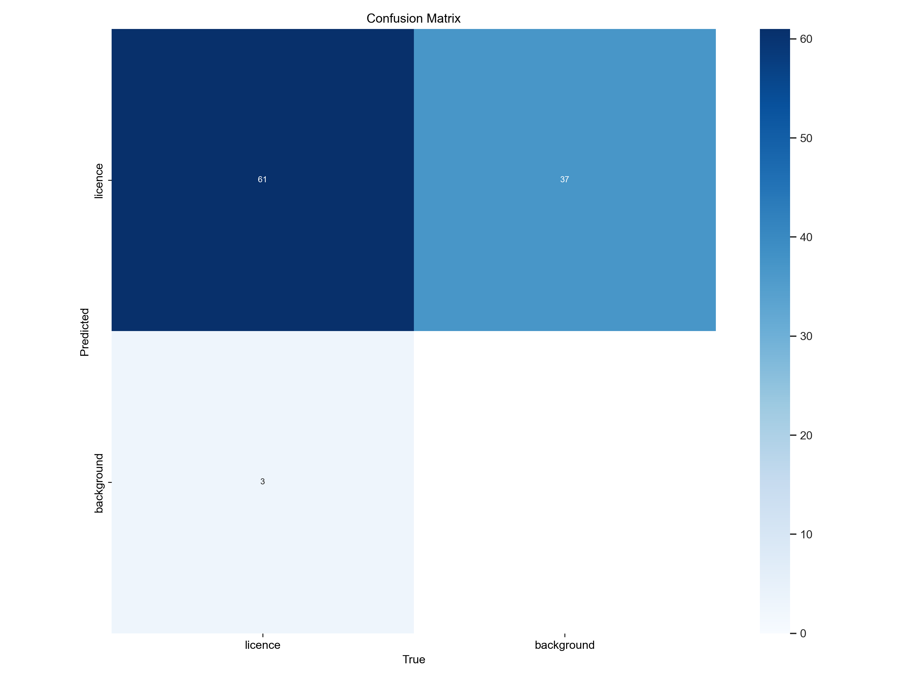
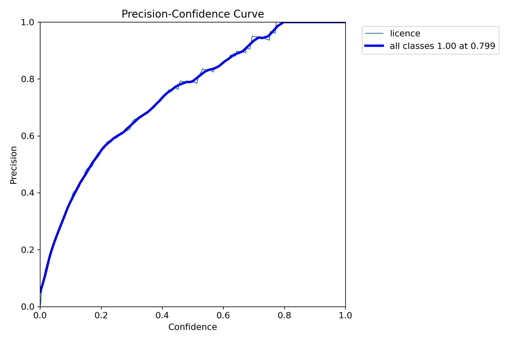
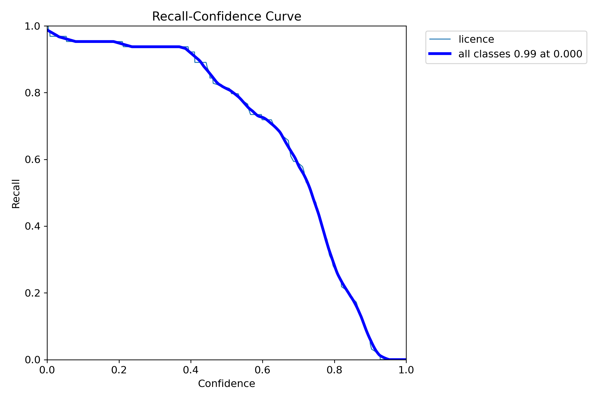
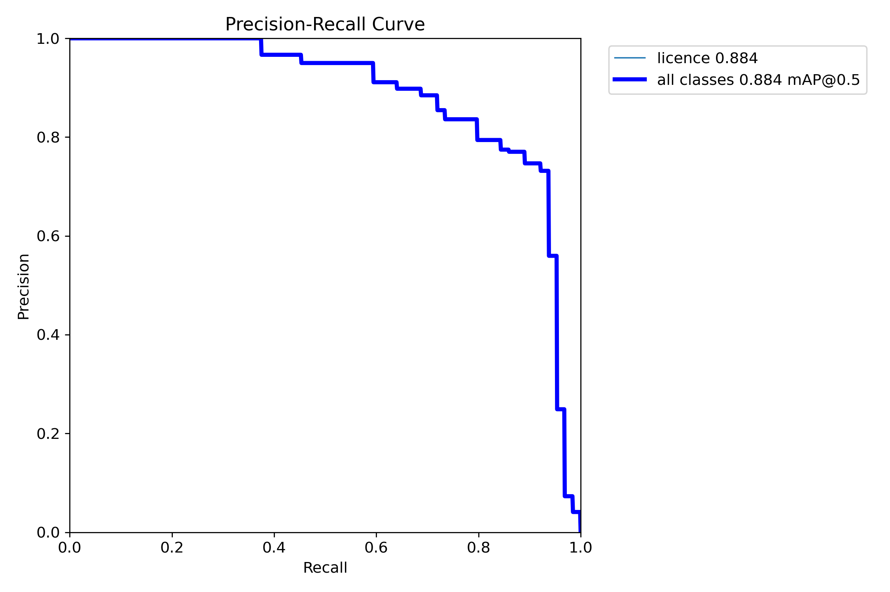
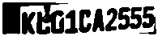
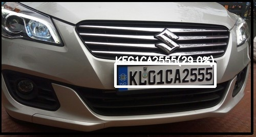
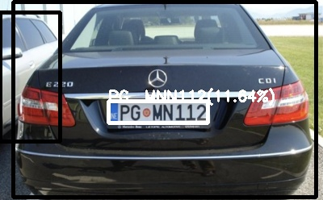
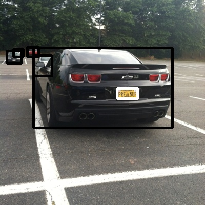

# PRÁCTICA 5: RECONOCIMIENTO DE MATRÍCULAS
### Por Alejando Rodríguez Moreno y Nauzet Déniz Perdomo

## 1. Detección de vehículos

Para la detección de vehículos se ha usado el modelo YOLO original que nos posibilita localizar los coches en una imagen. Utilizando el modelo YOLO, obtendremos las zonas de píxeles que contienen nuestros vehículos que en nuestra práctica los señalaremos con un rectángulo negro.

## 2. Detección de matrículas

En esta parte de la práctica se puede plantear de 2 formas, suponer donde se ubicaría la matrícula en el coche para obtener la mejor imagen de la matrícula y mandárselo al OCR para que detecte los carácteres, o entrenar otro modelo para la detección de matrículas.

### 2.1. Entrenamiento del modelo

Para entrenar el modelo obtuvimos un dataset en kaggle donde nos proporcionaban las imágenes y las etiquetas las cuales tuvimos que cambiar de formato para que se ajustaran al modelo YOLO. Una vez tuvimos las imágenes y las etiquetas preparadas dividimos las imágenes entre las 3 carpetas que se usan durante el entrenamiento, el 70% en la de entrenamiento, el 20% en la de validación y el 10% final en la de test. Con las imágenes ordenadas, utilizamos el modelo YOLO para entrenar uno nuevo que encuentre nuestras matrículas. Con nuestro modelo terminado, podemos localizar las matrículas en los coches con más facilidad, utilizando ambos modelos YOLO.

### 2.2. Resultados gráficos del entrenamiento

Aquí se encuentran los resultados gráficos del entrenamiento. Como podemos ver, en general son resultados realmente positivos.

  

  Diferentes métricas del entrenamiento

  
La matriz de confusión nos permite ver que una gran mayoría de las matrículas fueron reconocidas, habiendo varios falsos positivos, y solo 3 falsos negativos. Dado el gran número de falsos positivos, en la implementación se tomarán medidas, como asegurarse de que la matrícula se encuenre en un coche, para remediarlo.
  

  

  Matriz de confusión

  

  

  Precision curve

  

  

  Recall curve

  

  

  Precision-Recall curve

  

## 3. Lectura de matrículas

Una vez ya detectamos las matrículas, procedemos a usar la imagen de la matrícula para su lectura, para poder detectar mejor las matrículas se ha pasado la imagen a gris, se le ha introducido un filtro gaussiano y se ha umbralizado la imagen. Con esta imagen umbralizada se la pasamos a easyOCR, que en nuestra experiencia es el que mejor funciona en casos donde las imágenes no están tan bien definidas. Finalmente, escribimos el resultado en blanco encima de la imagen.

  

  Imagen de la matrícula una vez umbralizada.

## 4. Resultados

Por último los resultados, en cuanto a detección de vehículos y matrículas, el porcentaje de detección es muy alto, casi siempre encuentra todos los vehículos de la imagen y las matrículas si son visibles de estos coches. En cuanto a la lectura depende de lo bien definida que este la imagen de la matrículas ya que en algunos casos resulta muy dificil de leer o el umbralizado empeora más la imagen ya que no encuentra los contornos adecuados. A continuación algunos resultados.

  

  En esta imagen podemos ver que detecta KEG1CA2555 lo que sería casi perfecto menos por un carácter, e easyOCR nos indica que tiene un 29% de posibilidades que el resultado sea correcto.

  

  En esta imagen podemos ver que detecta PG MNN112 que es la matrícula perfecta, e easyOCR nos indica que tiene un 11.64% de posibilidades que el resultado sea correcto.

  

  En esta imagen podemos ver que detecta todos los coches de la imagen y la única matrícula visible, pero es incapaz de ver el contenido de la matrícula.

  

  Este es el resultado de la única matrícula detectada de la anterior imagen, como podemos observar al tener pocos píxeles no ha podido determinar correctamente si había carácteres dentro por lo que el resultado es este.

