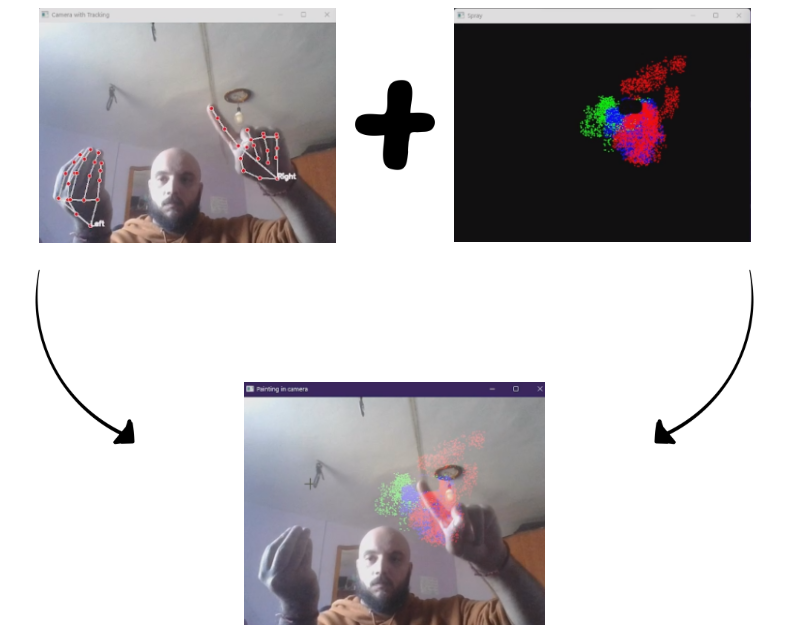

# PROYECTO FINAL: ANÁLISIS FACIAL
## Reconocimiento de gestos utilizando MediaPipe sin entrenamiento de modelo
### Por Alejando Rodríguez Moreno y Nauzet Déniz Perdomo

## Portada del Proyecto

## Documentación sobre el desarollo y funcionamiento

Se encuentra detallado en el siguiente fichero PDF: [VC Memoria Proyecto Final.pdf](VC%20Memoria%20Proyecto%20Final.pdf)

## Requisitos

Tener instaladas las siguientes librerías:

    * opencv-python (cv2)
    * numpy 
    * mediapipe

